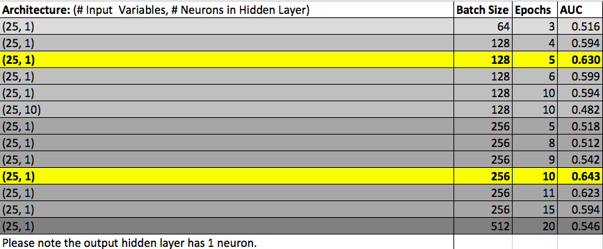
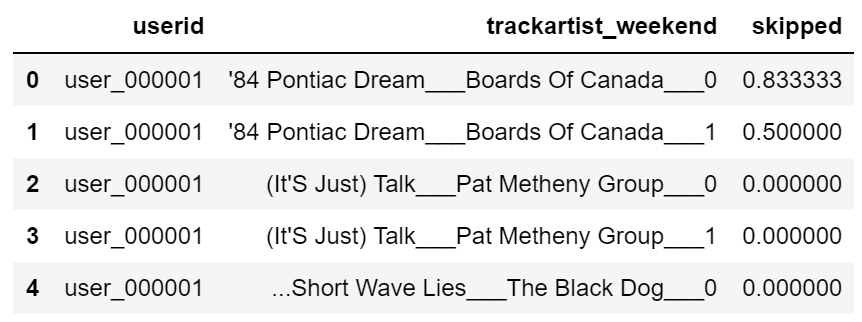

# Final Project
_**NOTE:** high level summary will go into the readme, this is the detailed writeup of our project. Think of this as our academic paper and the high level summary as a one pager._
## Introduction
We are designing a recommendation system that incorporates the users’ likelihood to skip a song into the final output.  We have designed a skips parameter based on whether the user has listened to the song for more than 60 seconds.  In other words, if the user stopped listening to the song before the 60 second timepoint, we consider the song to be skipped.

In our literature review of various recommendation engines that are based on the users’ listening habits, we have not encountered an approach that modeled the users’ skip preferences.  We believe this parameter to add significant value as it helps us understand the users’ preference for a song based on an unspecified activity.  It may be that the user has grown tired of the song and no longer wants to hear it, but it can also be the case that the user is in a different listening mood and prefers to listen to something else.  This has been the primary motivation for incorporating skips.

### Approach
***What did we want to do? What was our plan?***

We chose to build a hybrid model using a neural network and SVD++.

The neural network incorporates recency into the model, identifying how user preferences shift over the duration of their listening history.  Additionally, the neural network identifies latent features that affect a user's decision to skip a song.

Our SVD++ model incorporates periodicity and captures songs that a user has not yet listened, or songs in a new period, by identifying similarities in the latent space.  We have modified our ratings matrix to include skips and to incorporate a period for each song.  The SVD++ approach is a more nuanced version of the SVD baseline model from Part I.  The model adds an implicit user-factor to adjust the explicit user-factor matrix.  This implicit feedback matrix is constructed from the original ratings matrix by identifying which songs the user has skipped in a given period.  

Because both models output a vector of the probability a user will skip a song, we chose to run the models independently and combine the probabilities afterwards, hoping that the combined probability would improve the model's predictive power.

### Data
***Introduce the data, maybe provide some summary stats?***

We continued to use the Last.fm dataset, only this time we did not aggregate to the artist level. We instead kept the data in its disaggregated form, where each row is an observation of a user listening to a song at a given time. We engineered features to add to this data, mostly using the timestamp.

##### Feature Engineering
***Show new features and how we engineered them, particularly the predicted variable.***
Within our Feature Engineering file you are able to see all the 24 features we created from out base data set. 

###### Timestamp Columns:
  	* daytime (morning,afternoon, evening, etc; there are 5 time blocks)
	* day of week (monday= 0, tuesday = ,... sunday = 6)
	* weekday  
	* hour
	* weekend
	* quarter (fall, spring, summer, winter)
	* month
	* last seen song (last seen song by a user)
	* last seen artist (last seen artist by a user)
	
###### Count Columns: 
 	* track-weekday-count (count of times a song was listened to by the user over the weekday)
	* user-artist-weeday-count (count of times an artist was listened to by the user over the weekday)
  	* track-daytime-count (count of times a song was listened during a particular time of day)
  	* artist_total_count (cumulative count of times an artist was listened by all users)
  	* song_total_count (cumulative count of times a song was listened to by all users)
  	* user-artist-count (cumulative count of times a song was listened to by a particular user) 
	* user-track-total-count (cumulative count of times an artist was listened to by a particular user)

###### Skip Columns:
	* user-song-skips (for each user cumulative skip per song counts, a skip is a song listened to for less than 1 minute)
	* user-artist-skips (for each user cumulative skip per song counts)
	* user-song-skip-percentage (user-song-skips/user-track-total-count) 
	* user-artist-skip-percentage (user-artist-skips/user-artist-count)
	* global-song-skips (cumulative count of songs skipped over all users)
	* global-artist-skips (cumulative count of times an artist was skipped over all users)
	* global-song-skip-percentage (global-song-skips/song_total_count)
	* global-artist-skip-percentage (global-artist-skips/song_total_count)
###### Other Columns:
	* age (age of user)
	* gender (gender of user)

### Models

##### Neural Network
***High level plan***

##### SVD++
We designed a user-song matrix and used the skips as our parameter of interest.  The implicit factor $FY$ is then combined with the user-song latent space to form the reconstructed $(U+FY)V^T$ matrix.  This implies that simply act of skipping a song in a particular period contains significant information about the user's preference and unspecified activity.

In the SVD model from Part I, we used a binary variable for whether the song has been listened by a given user.  Such a derivation of user factors does not discriminate between users who have listened to the same set of songs, but have listened to higher quantities of individual songs.  Two such users will have exactly the same song recommendation by the original SVD model. 

##### Performance Evaluation

## Models

### Neural Network Implementation

#### Data Structure
***From the base dataset, did you do any other data prep?***
We added a gender int column assigning a 1 or 2 based on the user's gender. Otherwise we kept all other characteristics of the csv we created in the feature engineering notebook.

#### Imputation
Imputation was necessary for the nueral network. We contained many missing values that corresponded to unheard songs by a user. We imputed these values with zeroes. For most features this imputation of zero stood apropriate considering the feature purpose. Regarding the skip related column a zero value meant zero skips. If we only had skip-related columns then it might have been inapropriate to have unheard songs have a value of 0 putting them on par with songs that were listened to fully. However, songs listened to are treated differently than unheard songs in many other columns, and this allowed us to side-step the possible issues associated with our imputation. 

#### Model Exploration
We ran the neural network many times using a validation set and adjusting batch size, number of epochs, and the architecture. The chart below shows a few of our runs. We used AUC as evaluation metric for the validation set to help us choose our parameters. For our final neural network we choose our batch size to be 256, the epock size to be 10, and set up our architecture to have 25 input cariables and 1 neuron in the hidden layer.  

#### Model Results
***Final results?***

### SVD++ Implementation

#### Data Structure
Surprise requires the dataset to be in a tall format, with the matrix set up as _user-song-skipped_. To include periodicity, we need to distinguish the period in which a song was listened while keeping the form required by Surprise. To do this, we concatenated `trackartist` with `period`.

#### Imputation
We do not impute values in the SVD++ model as it automatically generates an implicit user-song matrix.  This is a binary of whether or not a user has listened the song in a given period.  This implicit matrix captures the missing values.

#### Model Exploration
We concatenated the period with the song name to incorporate a time factor in the SVD++ algorithm.  This way the model predicts whether the user is likely to skip an individual song during a given period.  The song name and period were combined with three underscores between them.  Afterwards, when we were splitting the predictions dataset to calculate AUC, we dropped several song names because they contained three underscores within the name.

#### Model Results
***Final results?***

### Ensemble
We can combine the SVD++ model with the neural network in two ways.

Method 1: We can combine the top K recommendations from the SVD++ model with the top K NN predictions with the lowest probability of being skipped.  The user is then shown these top K recommendation half of which incorporate a novelty aspect, while the otehr half from the NN incorporate just the users' historical behavior.

Method 2: After running the SVD++ model and the neural network, we create two skips probability vector for each user-song combination.  We then create a linear combination of these vectors to form our final output vector.  This vector can be thought of as an additional contextual feature about the users, which would be individually incorporated into a larger recommendation system that look at other aspects music personalization.

## Final Results
***Performance (both time and accuracy)***

***Would we use this? Does this model perform better on some users/songs than others?***

## Lessons
We restricted our SVD++ model to a single periodicity parameter (whether the song was listened to on a weekend or a weekday) as the size of the dataset grows rapidly with additional features.  If we had more computing power, then we could incorporate additional periodicity parameters (e.g., daytime, month, and holidays) and we could also tune our hyperparameters in the SVD++ model.  We could also look at whether the user had "repeated" the song by creating an indicator if the same song appears twice sequentially in our dataset.  This would be a feature independent from the skips parameter, which could be subsequently fed into a broader recommendation system as a probability input vector.

Additionally, we experimented with using Spark.  We originally decided on Spark because data engineering in Pandas is not always feasible since commercial datasets tend to be very large.  However, we found the setup process to be entirely different for Windows and macOS users.  As a result, we could not use consistent methods throughout our implementation.  Moreover, Spark has a steep learning curve for feature engineering.  We invested a significant amount of time to format our dataset and add new features – a process that is straightforward in Pandas.  Additionally, Spark libraries do not have a full implementation of the SVD++ algorithm.  We attempted to craft the algorithm from scratch using matrix factorization and stochastic gradient descent operations, but found it prohibitive to experiment with hyperparameters given the size of the dataset. We managed to implement the Neural Network on Spark (ml library's multi-layer perceptron implementation) but the setup was not configured appropriately for our local machines so the model would not train. We finally resorted to using Tensorflow for the NN.
