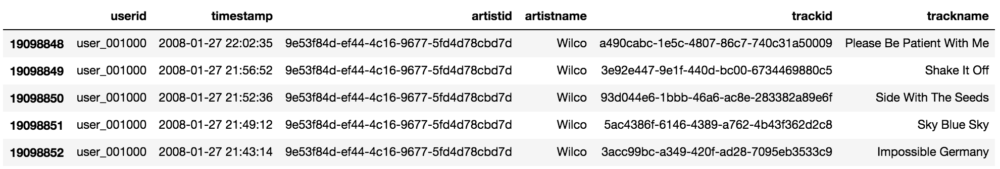
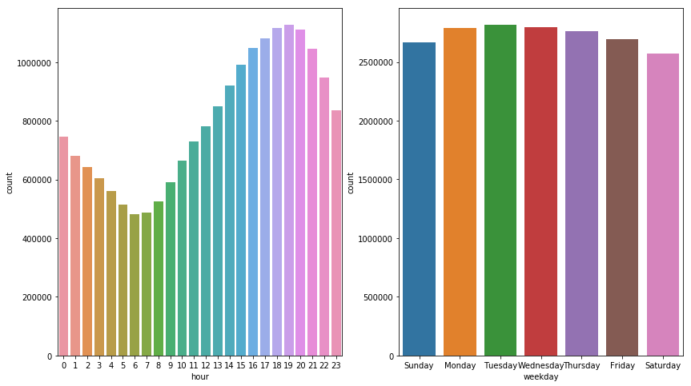

# Last.fm Recommender System

We chose to investigate the Last.fm data set using a temporal collaborative filtering model.  Specifically, we want to investigate the effect that time of day and weekday has on the users' listening habits.  Our objective is to reduce the number of times a user will skip the song.  Because we are using skips as a proxy for a users' enjoyment of the song, we do not need to rely on explicit feedback, such as the users' song ratings.  In addition, since consumer preferences change over time, we do not account for how long it has been since a user has rated a song.  Skips occur in the present so we can ignore this recency factor.

## The Data

Last.fm data set contains:
* Listening habits for 992 users
* 173,921 artists with timestamped entries
* Metafile containing user profiles (e.g., gender, age, country and signup date).

The data set can be found through this [link](http://www.dtic.upf.edu/~ocelma/MusicRecommendationDataset/lastfm-1K.html). The data was collected by Òscar Celma.
 
The data set records users’ listening history without recording explicit feedback on artist and track pairs.  As there is no input from a user on whether they liked or disliked a track, we initially treat the data as an indication of positive preference. This will be expanded to include skips for the full recommender system.

A preview of the data is shown here, with the leftmost column as the Pandas index:

The following is the play counts for the entire data set, grouped by hour of the day (left) and day of the week (right):

## Part I Objective
We are interested in learning how neighborhood- and model-based collaborative filters (CF) perform on aggregated data. These CF approaches help us understand how an improved recommendation engine can drive increased user engagement within a music platform.  We intend to utilize timestamps for the final project along with other metadata to improve the quality of our recommendations.

### PartI Models Used : Neighborhood Collaboritive Filtering & SVD
We implemented an neighborhood based collaorative filtering techniqu for our user-based CF and implemented the SVD algorithm as our model-based CF. With both these models we predicted values indicating whether a user would listen to a particualr artist. For more information look to the Part I Detailed file.

### Conclusion of Part I
The neighborhood-based collaborative filter results in a better RMSE at higher values of k, but does not bring MAE to a competitive level when compared to the baseline model. On the other hand, the SVD model-based collaborative filter outperforms the baseline at almost every comparison. Our initial results of this analysis suggests that SVD model would be more effective at predicting user preferences. We believe this model would be helpful for a draft recommender system.

## Part II Objective

We incorporated timestamps to further clarify users’ preferences for artists and tracks.  Based on these data points, we have derived a skips parameter (i.e., the difference between start time and end time for a song is less than a minute). This parameter indicates whether the user skipped to the next track in the playlist. The information derived from skip related features and predicted skip values could help us answer questions such as:
* Can music recommendation be improved by incorporating skips?
* Can we use timestamps and skips to identify the user’s mood in a given time period (i.e., genre preference given certain time of day)?
* After how many times of listening to a track is a user more likely to start skipping the track?

### PartII Models Used : Nueral Network & SVD++ Ensemble
We used a hybrid approach mixing a neural network and a SVD++ model with a periodicity term.  The neural network incorporates recency into the model, identifying how user preferences shift over the duration of their listening history. The SVD++ brings in a collaborative filtering component by capturing songs that a user has not yet listened by identifying similarities between user-song pairs in the latent space. We combined these two models into a linear ensemble with 90% SVD++ and 10% Neural Network. For more information look to the Part II Detailed file. 

### Conclusion of Part II
The Neural Netowrk was able to train in a matter of minutes with many features, while the SVD++ model trained over many hours with only a few features. However, our SVD++ model significantly outpeformed the neural network model. Due to this we weighted the SVD model as 90% of our combined liear enseble and the neuroal network as only 10% of the combined linear ensemble. The AUC from the linear enseble (at 0.808) we created is marginally higher than the SVD++ standalone AUC (at 0.807 ) and significantly higher than the Neural Network AUC (at 0.609). An AUC of 0.8 tell us that we could use our ensemble model or simply the SVD++ for reccomendation in a professional setting. 
