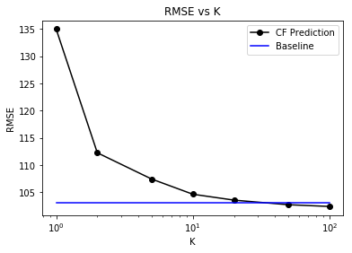
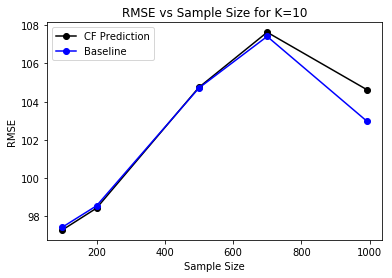
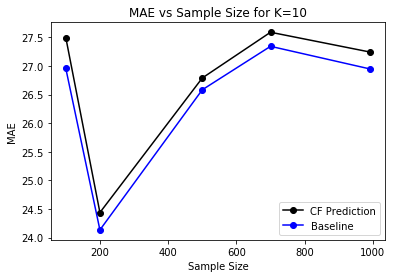
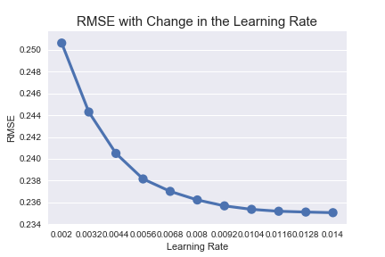
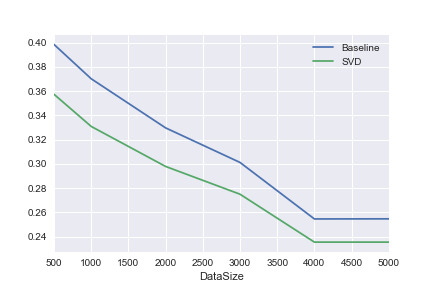

# Last.fm Recommender System

We chose to investigate the Last.fm data using a temporal collaborative filtering model; specifically, we want to investigate the effect time of day and day of the week has on users' listening habits, with our objective to reduce the number of times a user will skip the song. Because we are using skips as a proxy for a user's enjoyment of the song, we do not need to rely on explicit feedback data, such as a user's song rating. In addition, we do not need to be wary of how long it has been since a user has rated a song, since consumer preferences can change over time. Because skips are all in the present, we can ignore this recency factor.

## The Data

Last.fm data set contains:
* Listening habits for roughly 992 users
* 173,921 artists with timestamped entries
* Metafile containing user profiles (e.g., gender, age, country and signup date).

The 1K data set can be found through this [link](http://www.dtic.upf.edu/~ocelma/MusicRecommendationDataset/lastfm-1K.html). The data was collected by Òscar Celma.
 
The data set records users’ listening history without recording explicit feedback on artist and track pairs.  As there is no input from a user on whether they liked or disliked a track, we initially treat the data as an indication of positive preference. This will be expanded to include skips for the full recommender system.

A preview of the data is shown here, with the leftmost column as the Pandas index:

The following is the play counts for the entire data set, grouped by hour of the day (left) and day of the week (right):

## Part I Objective
We are interested in learning how neighborhood - and model-based collaborative filters (CF) would perform on aggregated data. These CF approaches will help us understand how an improved recommendation engine can drive increased user engagement with the music platform.  We intend to ustilize timestamps fot the final project along with other metadata to build better personalization systems.

### Neighborhood-Based Collaborative Filter Analysis
We implemented an user-user neighborhood based collaorative filtering technique. We tried to predict the interest that a user may have in a particular artist in terms of the number of times they would listen to an artist, based on their average artist plays and that of their peers.

#### Data preprocessing
We grouped our data into artists and users for the first part of the project, with the values as number of plays. Hence the recommendations are at an artist level and not individual songs. There is no additional pre-processing.

#### Similarity Metric
We used Pearson correlation, primarily because of the nature of the dataset and how missing values are interpreted. We found the find similarity between users on their common tastes, irrespective of missing values.

#### Training and Testing data
We split the dataset into 80-20 train-test split. This split was not completely random. For each user, a random 20% of the artists they listen to are put into the test data. This ensures that every user is represented in the test data. There is no explicit validation (tuning) dataset. This choice was made because of the nature of the model which relies on the similarities between users, has only one hyperparameter K and has no scope for overfitting the test data. Having an additional tuning dataset would result in loss of data for training purposes. 

#### Model evaluation
Since the prediction value is the number of times a user is expected to listen to an artist, which is a continuous variable, we chose to use RMSE and MAE, which are standard metrics for evaluating continuous predctors.

#### Additonal Design Considerations
We considered having an item-item based collaborative filtering model but decided to stick with user-user based. This choice was made because we have 992 users but nearly 174,000 unique artists. The similarity matrix for such a large number of items would be huge as well as extremely sparse. Most artists feature only a few times in the dataset and hence would not have any similar neighbors for a meaningful analysis. 

We also decided to work with aggregated artists for the first part of the project. This helps reduce the size and complexity of the data for our first exploration of the data. For our final project, we will include content based models with time as an important variable.

#### Model performance with hyperparameter tuning
The model has only one hyperparameter - the neighborhood size K. Increasing K improves both RMSE and MAE. 

#### Model performance with data size
We varied the data size sytematically from 100 users to 1000, keeping a constant K value. The results are follows:

#### Scaling of running time with data size
Finding user-user similarity matrix is an O(n2) operation as each pair of users need to be assessed. Making predictions is an O(K\*n) operation, as for each user, we need to look at all their K peers and predict accordingly. The total running time is hence asymptotically dominated by the similarity matrix step which scales as O(n2).

### Model-Based Collaborative Filter Analysis
We used the SVD algorithm as our model-based CF.  We used the Surprise package, which can be installed using the following command: `pip install scikit-surprise`.  Read more about Surprise [here](http://surpriselib.com/).

#### Data preprocessing
We grouped our data into artists and users for the first part of the project, with the values as a binary on whether the user listened to the artist. The recommendations are at an artist level and not individual songs. We then had to add all the artists each user has not listened to, setting the value to `0` for did not listen to the artist. In addition, we removed all artists not in the top 5000 by number of plays, as the model does not scale well to massive datasets. If we were to include all artists, the prepared dataset would be over 173 million rows.

#### Training and Testing data
We used 3 folds for all of our models.

#### Model evaluation
We used a simple Alternating Least Squares (ALS) model to use as a baseline for our model-based CF. This came as a default model in the `Surprise` package. We use this to assess the results of our Singular Value Decomposition (SVD) model below.

SVD outperforms ALS across nearly all of our hyperparameter tuning and data size variation. With our optimal SVD model, we see the following results compared to the baseline:

Model | RMSE | MAE
--- | --- | ---
ALS (baseline) | 0.2547 | 0.1366
SVD | 0.2355 | 0.1199

#### Model performance with hyperparameter tuning
We tuned the number of factors, the regularization coefficient, and the learning rate of our SVD model to find a more optimal model. Our best model, when using RMSE and MAE as our accuracy metrics, used 120 factors, a regularization coefficient of 0.02, and a learning rate of 0.01.

##### Number of Factors
As the number of factors in the model increases, our RMSE decreases.

##### Regularization Coefficient
As the regularization coefficient increases, our RMSE increases. Once this coefficient goes about 0.06, our model stops outperforming the baseline.

##### Learning Rate
As the learning rate increases, our RMSE decreases.

#### Additonal Design Considerations
After seeing these results, we would like to see if we can use more computing power to increase the number of artists and complexity of the model. We think this might result in improved results.

We also would like to include more features as part of this model. The dataset came with very limited information about the artists. We believe that including additional information, such as genre or nationality of artist, might add additional value to the model.

#### Model performance with data size
The model loses quite a bit of accuracy as the data size decreases. However, SVD is not an efficient algorithm, so as the number of artists increases, the amount of time to train the model increases exponentially. This makes it very computationally expensive to update the model.

The accuracy of the baseline and our model increase with an increased number of artists. SVD still outperforms the baseline at every size.

RMSE of ALS and SVD as number of artists increase:

MAE of ALS and SVD as number of artists increase:

#### Scaling of running time with data size
SVD has a running time of O(min{mn2, m2n}). As our number of users `n` is fixed at 992, the runtime is O(m2n). As the number of artists grow, the runtime increases exponentially.

### Conclusion
The neighborhood-based collaborative filter results in a better RMSE at higher values of k, but does not bring MAE to a competitive level when compared to the baseline model. This is somewhat surprising, but demonstrates that this model would not be useful in a production setting.

On the other hand, the model-based collaborative filter outperforms the baseline at almost every comparison. Our initial results of this analysis suggest that a model-based collaborative filter will be more effective at predicting user preferences. While the model can certainly be improved with a more granular look at the data, we believe this model would be helpful for a draft recommender system.

While the neighborhood-based CF used a different data structure than the model-based CF, this is due to the nature of the models. The comparison to the baseline is a better indicator of model performance than the comparison to each other.

## Part II Objective
We will incorporate timestamps and signup dates to further clarify users’ preferences for artists and tracks.  Based on these data points, we can derive a skips parameter.  This parameter indicates whether the user skipped to the next track in the playlist and will help us answer questions such as:
* Can skips be used to improve music recommendation?
* Can we use timestamps and skips to identify the user’s mood (i.e., genre preference given an unspecified activity)?
* After how many times of listening to a track is a user more likely to start skipping the track?
 
 
## Sources/Relevant Literature
 
Hu, Y., Koren, Y., & Volinsky, C. Collaborative Filtering for Implicit Feedback Data Sets. Retrieved from http://yifanhu.net/PUB/cf.pdf
